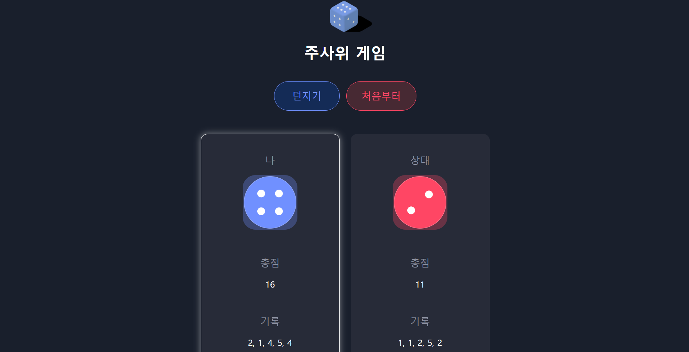

# Dice Game
|||
|:-:|:-:|
|'던지기' 버튼 클릭 시|'처음부터' 버튼 클릭 시|

## About
React로 구현한 주사위 게임. '던지기' 버튼 클릭 시 두 주사위의 결과가 랜덤으로 출력되며, 승리하는 쪽 보드에 불이 들어온다. 주사위의 결과들은 기록 영역에 저장되고, 총점이 계산되어 출력된다. '처음부터' 버튼 클릭 시 모든 기록들이 초기화되면서 초기 화면으로 돌아간다.

## Stack
HTML, CSS, JavaScript, React.js

## Period
2021.11.18. ~ 2021.11.26.

## Roadmap
- [X] 주사위 컴포넌트 추가
- [X] 버튼 컴포넌트 추가
- [X] 보드 컴포넌트 추가
- [X] CSS 스타일 적용

## Error
|Problem|Solution|
|:-|:-|
|'던지기' 버튼을 클릭할 때마다 주사위 결과가 더 높은 쪽 보드에 불이 들어오는 효과가 제대로 적용되지 않는 현상.|비교 대상이 다음에 올 주사위의 결과 값이어야 했는데, 결과 기록들이 저장되는 State 배열을 두고 비교 중이었다. State를 제대로 이해하지 못한 채 사용하다 일어난 문제. 각 변수와 배열이 무엇을 담고 있고, 지금 비교해야 할 대상이 무엇인지 정확히 이해를 마친 뒤 코드를 수정하여 해결.|
